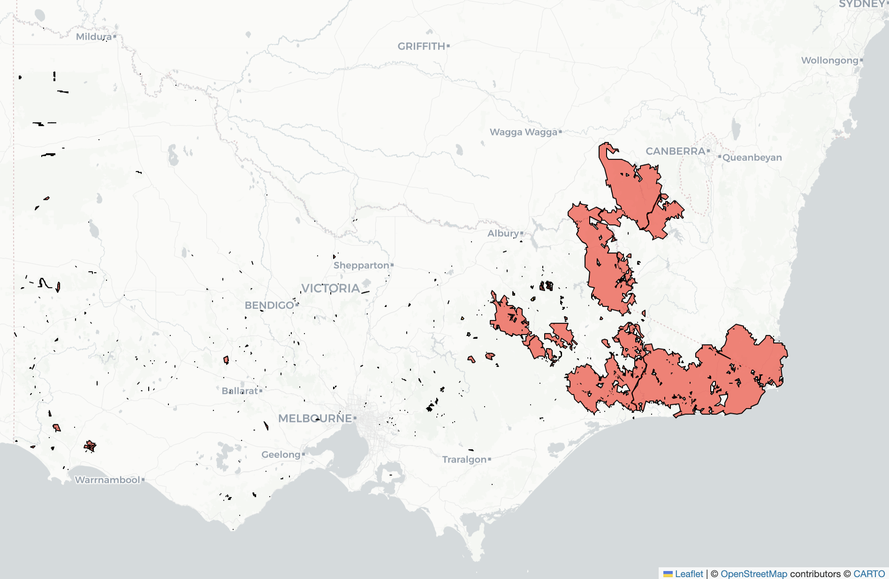

# Historical Bushfire Boundaries Dataset (Geoscience Australia)

## Overview

The Historical Bushfire Boundaries Dataset (version 4) is a nationally aggregated collection of burnt area polygons managed by Geoscience Australia. It covers both wildfires and prescribed burns across Australia from 1898 through to 2025, with each state's fire agency contributing their own curated boundary data. For this project, it serves as the authoritative 'ground truth' record of the 2019–2020 Black Summer fire extents across Victoria, supplied by DEECA.

## Data Access

The data is provided as a zipped **file geodatabase (.gdb)**, a spatial format that must be extracted to a local directory before it can be accessed via Python's `geopandas` library. Once unzipped, the structured database allows for querying of vector geometries and metadata, acting as the ground truth of officially mapped burn scars.

- **Source:** Geoscience Australia via the Digital Atlas of Australia
- **Format:** File Geodatabase (FGDB), 847MB zipped
- **License:** Creative Commons Attribution 4.0 (CC BY 4.0)

## Data features

Each polygon represents a single fire or prescribed burn event with the following attributes relevant to our modelling:

- **Temporal:** `ignition_date`, `capt_date`, and `extinguish_date` allow for tracking the lifecycle of each fire event
- **Spatial:** pre-calculated `area_ha` and `perim_km` fields
- **Fire type:** `fire_type` distinguishes wildfires from prescribed burns, important for filtering our training data to genuine uncontrolled fire events
- **Ignition cause:** `ignition_cause` provides contextual metadata on how each event started
- **Capture method:** `capt_method` indicates whether the boundary came from aerial mapping, ground survey, or another source, which is a useful proxy for accuracy

| Attribute Name   | Field Type | Description                                                                                          |
|------------------|-----------|------------------------------------------------------------------------------------------------------|
| `fire_id`          | String    | Unique ID attached to the fire.                                                                      |
| `fire_name`        | String    | Official incident name (if available).                                                               |
| `ignition_date`    | Date      | Estimated date of ignition. Captured in local time and converted to UTC.                            |
| `capt_date`        | Date      | Date the boundary was captured or updated. Converted to UTC.                                         |
| `extinguish_date`  | Date      | Date the fire was declared safe/contained (if available).                                            |
| `fire_type`        | String    | Binary variable: Bushfire or Prescribed Burn.                                                        |
| `ignition_cause`   | String    | The identified cause of the fire.                                                                    |
| `capt_method`      | String    | Categorical variable describing the data source used for the spatial extent.                         |
| `area_ha`          | Double    | Total burnt area in hectares, calculated in a consistent national projection.                        |
| `perim_km`         | Double    | Total burnt perimeter in kilometres.                                                                 |
| `state`            | String    | The state custodian of the data (may include cross-border records).                                  |
| `agency`           | String    | The specific agency responsible for the incident management.                                         |

## Use cases

Within FireFusion, this dataset plays three roles:

1. It is our primary ground truth source, the burnt area polygons act as the answer key against which satellite thermal detections are validated.
2. It forms the basis of our training targets, teaching the model the relationship between pre-fire conditions and an actual mapped burn scar.
3. Its long historical record enables fuel age analysis: by identifying how many years have passed since a given area last burned, we can incorporate fire history as a predictive feature in the model.

### **Black Summer Victorian Fire Spread**
The following map shows the extents of the fires in Victoria during the Black Summer period (June 2019 - March 2020), generated from the polygons in the Historical Bushfire Boundaries Dataset.



<details>

<summary><b>View Python Code used to generate this map</b></summary>

```python
import geopandas as gpd
import pandas as pd
import folium

df = gpd.read_file("Historical Bushfire Boundaries.gdb", engine='pyogrio', method='skip').to_crs(epsg=7844)

df['ignition_date'] = pd.to_datetime(df['ignition_date'], errors='coerce')

# Filter for the Black Summer window (June 2019 - March 2020) and Victoria
start_date = '2019-06-01'
end_date = '2020-03-30'

black_summer = df[(df['ignition_date'] >= start_date) & (df['ignition_date'] <= end_date)]
black_summer_vic = black_summer[black_summer['state'] == "VIC (Victoria)"].copy()

# Generate map
map_center = [-37.5, 147.0]
vicmap = folium.Map(location=map_center, zoom_start=8, tiles='cartodbpositron')

folium.GeoJson(
    black_summer_vic[['geometry']], 
    style_function=lambda x: {
        'fillColor': 'red',
        'color': 'black',
        'weight': 0.5,
        'fillOpacity': 0.6
    }
).add_to(vicmap)

vicmap
```
</details>


## Data Limitations

While the Historical Bushfire Boundaries dataset provides the necessary spatial "ground truth" for burned areas, an audit of the Victorian subset during the 2019–2020 Black Summer period reveals significant temporal gaps that constrain its use as a standalone modelling resource.

### Identified Data Gaps

The following fields are entirely null across all Victorian records in the Black Summer window (n = 3,638):

- `extinguish_date` — no containment or extinguishment timestamps are recorded for any event
- `capt_date` / `capt_method` — no metadata indicating when or how individual perimeters were digitised
- ignition_cause — predominantly missing or recorded as "Unknown", precluding any analysis of human vs. natural ignition vectors


### **Attribute Gaps: Victorian Black Summer Subset**
The following table shows the values of selected attributes that appear in the Victoria Black Summer subset of the Historical Bushfire Boundaries Dataset.

| Category        | Value   |   Count |
|:----------------|:--------|--------:|
| Extinguish Date | NaT     |    3638 |
| Ignition Cause  |         |    3638 |
| Capt Method     |         |    3638 |
| Capture Date    | NaT     |    3638 |

<details>
<summary><b>View Python Audit Code</b></summary>

```python
# Filter for the Black Summer window (June 2019 - March 2020)
start_date = '2019-06-01'
end_date = '2020-03-30'
black_summer = df[(df['ignition_date'] >= start_date) & (df['ignition_date'] <= end_date)]
black_summer_vic = black_summer[black_summer['state'] == "VIC (Victoria)"].copy()

categories = ['extinguish_date', 'ignition_cause', 'capt_method', 'capture_date']

summary_frames = []
for cat in categories:
    counts = black_summer_vic[cat].value_counts(dropna=False).reset_index()
    counts.columns = ['Value', 'Count']
    counts['Category'] = cat.replace('_', ' ').title()
    summary_frames.append(counts)

categorical_summary = pd.concat(summary_frames)[['Category', 'Value', 'Count']]
print(categorical_summary.to_markdown(index=False))
```

</details>


### Impact on Predictive Modelling

The absence of these timestamps reduces the GDB polygons to a final-state snapshot of destruction, with no record of how that destruction unfolded. Ultimately, this means we cannot derive rate of spread or fire front progression, cannot model how long a fire remained active under particular fuel and weather conditions, and cannot account for the unknown lag between a fire event and its recording.

### The Satellite Opportunity

This limitation confirms that the Historical Bushfire Boundaries Dataset alone is insufficient for a predictive model and presents the need for including multi-sensor satellite data. MODIS and VIIRS active fire detections provide the sub-daily continuity, allowing us to reconstruct fire progression in a way that this dataset cannot. Fire Radiative Power and brightness can be used to infer fire activity levels over time, and monitoring the dissipation of thermal anomalies provides a workable proxy for containment where `extinguish_date` is absent.

However, satellite detection is not without limitations. Gale & Cary (2025) demonstrate this in the context of the Black Summer fires themselves, using VIIRS detections to infer rate of spread across southeast Australian forests. While their method achieved strong spatial agreement with airborne linescan data, they note that cloud obscuration and smoke can interrupt fire detection continuity and introduce uncertainty into progression estimates. They also found that gridded weather inputs frequently underpredicted windspeed at the fire ground, which cascades into errors in any model that depends on satellite-derived progression data paired with reanalysis weather.

This is what makes the two data sources complementary rather than interchangeable. The GDB polygons, while temporally coarse, represent validated and administratively confirmed burn extents, making them a stable spatial ground truth against which satellite detections can be cross-referenced and calibrated. Where satellite data provides temporal depth, the GDB provides spatial confidence. Used together, they give our model a more complete picture than either source could offer alone.


## References

---

Gale, M. G., & Cary, G. J. (2025). Evaluating Australian forest fire rate of spread models using VIIRS satellite observations. *Environmental Modelling & Software*, *188*, 106436. https://doi.org/10.1016/j.envsoft.2025.106436