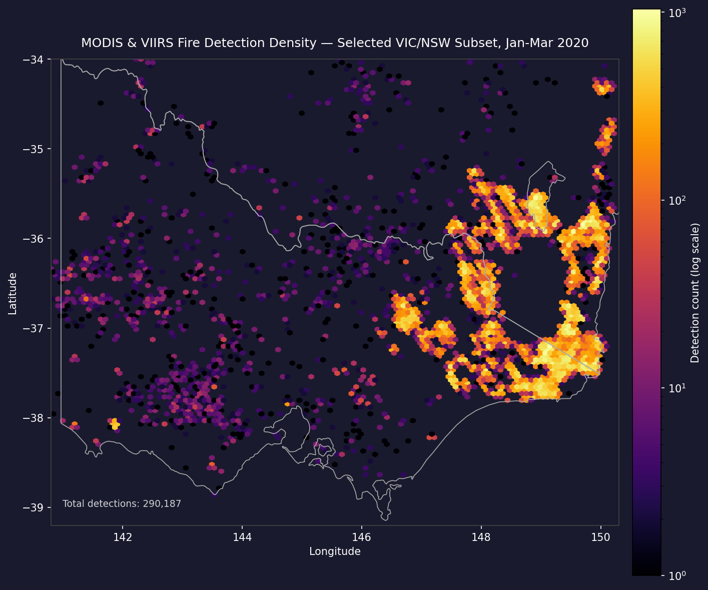
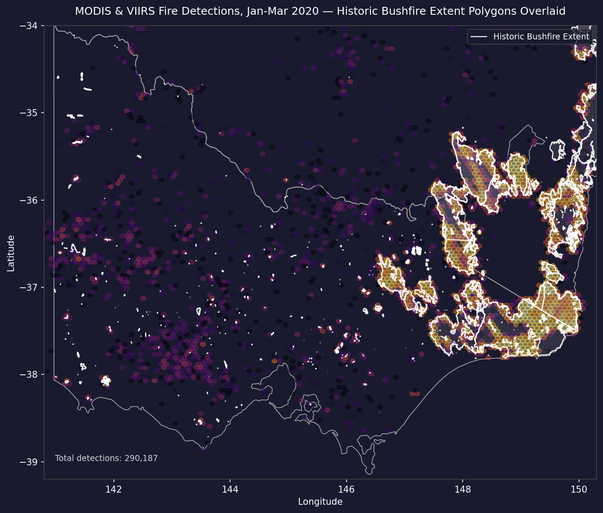
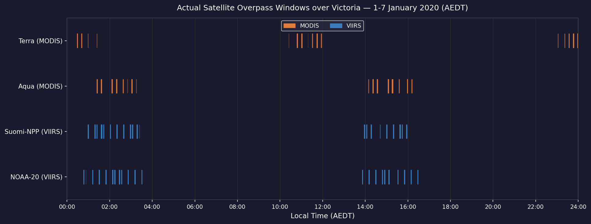
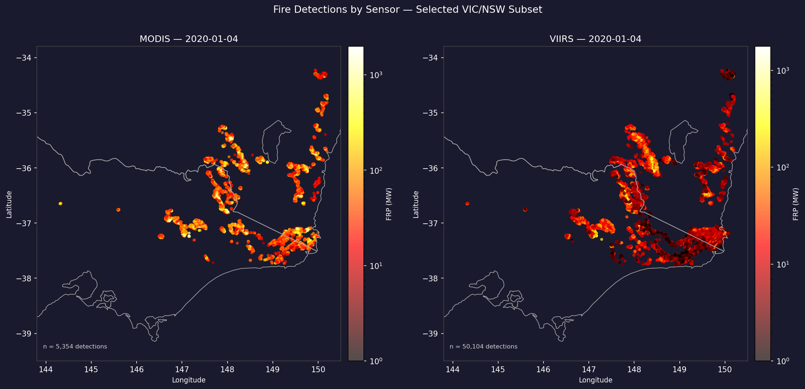

# MODIS & VIIRS Satellite Sensors

## Overview

MODIS and VIIRS are two sensors aboard NASA satellites that orbit the Earth, collecting data used to observe phenomena occurring on the Earth's surface and atmosphere.

**MODIS**
- The Moderate Resolution Imaging Spectroradiometer (MODIS) collects data across 36 spectral bands ranging from visible to thermal infrared wavelengths.
- It is carried aboard two satellites: Terra (launched 1999) and Aqua (launched 2002).
- It scans the entire Earth's surface, observing Victoria, Australia 1-2 times per day.
- It observes fires at a resolution of 1 kilometre (1km x 1km).
- For fire detection, MODIS uses its mid-infrared and thermal bands to identify active fire pixels and estimate Fire Radiative Power.

**VIIRS**
- The Visible Infrared Imaging Radiometer Suite (VIIRS) was designed as a successor to MODIS and flies aboard the Suomi-NPP (launched 2011), NOAA-20 (launched 2017), and NOAA-21 (launched late 2022) satellites.
- It improves on MODIS with a dedicated **375m resolution** fire detection band, offering finer spatial detail that is particularly useful for identifying smaller or early-stage fires that MODIS pixels may miss.
- Note: NOAA-20 and NOAA-21 satellites are also referred to as JPSS-1 and JPSS-2, respectively.

**Combined Capabilities for Victoria** 
- Together, the Terra, Aqua, Suomi-NPP, NOAA-20, and NOAA-21 satellite overpasses provide usually at least four observations per day over Victoria, distributed across morning and afternoon windows.
- This multi-satellite coverage reduces the chance of a fire event falling entirely within a gap between passes.
- The combination of MODIS's longer historical record with VIIRS's improved resolution gives a more complete picture of fire activity than either sensor alone.

**To note:**
- These four passes are not evenly spaced. They usually cluster into two "Day" passes (between 10:30 AM and 1:30 PM) and two "Night" passes (between 10:30 PM and 1:30 AM).

For our goal of reconstructing historical fire extent and progression across Victoria during the 2019–2020 Black Summer period, both datasets will be used to identify active fire detections, from which we can derive fire presence, perimeter evolution, and FRP values as inputs for our predictive model.


## Data Access

- **Source:** [NASA FIRMS](https://firms.modaps.eosdis.nasa.gov/country/) (Fire Information for Resource Management System)
- **Format:** Comma-Separated Values (CSV) files
- **License:** [NASA Earth Science Data Policy](https://www.earthdata.nasa.gov/engage/open-data-services-software-policies) (Free and Open Access - NASA's Earth Science Data Systems encourages citation and acknowledgment of NASA data and services whenever data or works based on the data are published)

NASA's Fire Information for Resource Management System (**FIRMS**) is the primary portal for both MODIS and VIIRS fire data, providing access to historical archives and near real-time detections updated within a few hours of satellite overpass. For our exploratory analysis, we have downloaded CSV exports directly from the FIRMS archive, covering Victoria across the 2019–2020 fire season.

For our production data pipeline, we plan to access both datasets through Google Earth Engine (GEE), which hosts the full historical record of MODIS and VIIRS fire products, and updates with near real-time data within 3 hours of satellite observation. GEE allows for server-side spatial filtering, temporal aggregation, and direct export to our planned grid structure, avoiding the need to handle raw satellite files locally.


## Data Features

Each observation in the FIRMS dataset represents a single satellite overpass detection of an active fire pixel. 
The features relevant to our project are:

- **Latitude & Longitude** — the centre coordinates of the detected fire pixel, which we use to map detections onto our 1km² Victoria grid
- **Acquisition Date & Time** — the UTC timestamp of the satellite overpass, used to reconstruct the temporal progression of fire activity
- **Day/Night (D/N)** — indicates whether the detection occurred during a daytime or nighttime pass. Nighttime detections can be more sensitive as there is less solar reflection interfering with thermal bands
- **Satellite** — identifies which satellite made the detection (e.g. Terra, Aqua, Suomi-NPP), which is relevant when reconciling multiple overpasses within the same time window
- **Instrument** — identifies the sensor used (MODIS or VIIRS), important given that spatial resolution and detection thresholds differ between the two

### Brightness

Brightness temperature is the thermal emission measured at the sensor, recorded in Kelvin. Higher values indicate more intense heat at the surface. It is primarily used to confirm a genuine fire detection and feeds into FRP estimation, though like FRP it is not directly comparable across sensors due to differences in band characteristics and pixel size.

### Confidence

Confidence is a quality indicator, expressed either as a percentage (MODIS) or a categorical low/nominal/high rating (VIIRS), reflecting how certain the algorithm is that the detected pixel represents a genuine fire rather than a false positive from sources like sun glint, industrial heat, or volcanic activity. For our modelling purposes, we will apply a confidence threshold to filter out low-quality detections before using the data as fire presence labels. Retaining low-confidence detections risks introducing noise into the training data, while filtering too aggressively may cause us to miss real fire pixels.

### Fire Radiative Power (FRP)

Fire Radiative Power (FRP) measures how quickly a fire releases energy as radiation, aggregated across everything burning within a single pixel. It's widely used as a stand-in for fire intensity, linking to how fast biomass is being consumed and how much is being emitted into the atmosphere. While FRP estimates are included in both the MODIS and VIIRS sensor data, the values are not directly comparable between sensors. Things like pixel size, the temperature at which thermal bands saturate, the satellite's viewing angle, and the time of the observation all introduce variability into the estimates, and those factors need to be considered when working with FRP data across multiple sources.

In practical terms, FRP tells us how powerful a fire is at the time of detection, measured in Megawatts. For our model, it serves as a potential proxy for fire intensity at a given cell and timestep, which may help predict the rate and direction of subsequent spread.


## Use Cases

**1. Time-Series Ground Truth for Training**

A primary potential use of the FIRMS dataset is to provide target labels for the FireFusion model. By mapping MODIS and VIIRS detections onto a standardised grid of Victoria, it is possible to construct a binary fire/no-fire classification, or a continuous FRP intensity map for each 12-hour window across the Black Summer period. Cross-referencing these detections against the Geoscience Australia Historical Bushfire Boundaries dataset could allow satellite-derived fire presence labels to be validated against government-confirmed burn extents, producing a more robust training target than either source provides alone.

**2. Reconstructing Rate of Spread and Direction**

By analysing the sequence of detections across consecutive satellite overpasses (for example, comparing a morning Terra pass to an afternoon Suomi-NPP pass) it may be possible to track fire lines over time. This could enable the calculation of approximate spread velocity (how many grid cells the fire advanced between observations) and a directional spread vector, which could then be correlated with wind direction, slope aspect, and fuel load to inform the model's understanding of how environmental conditions drive propagation. Gale & Cary (2025) demonstrated this approach using VIIRS detections across the Black Summer fires, achieving strong spatial agreement with airborne linescan data, supporting the viability of this method for our study.

**3. Fire Intensity as a Predictive Feature**

FRP values could be used to distinguish between low-intensity surface fires and high-intensity crown fires within the model's feature set. High-FRP events are associated with fire behaviour such as pyrocumulonimbus development, where the fire begins generating its own local weather. Incorporating FRP as an input feature may help the model identify conditions under which standard behavioural assumptions break down.

<br>

### **MODIS & VIIRS Detection Density with Historical Burn Boundaries — Jan-Mar 2020**
The following maps show all MODIS and VIIRS fire detections across Victoria and New South Wales for January–March 2020, with confirmed Historical Bushfire Boundary polygons overlaid in white. The hexbin density layer illustrates where detections were most concentrated, while the boundary polygons provide the government-confirmed burn extents for the same period. The spatial correspondence between the two layers supports using satellite detections as a proxy for active fire presence, while also illustrating the complementary role of the boundary data as a validated spatial ground truth.



<details>

<summary><b>View Python Code used to generate this plot</b></summary>

```python
import pandas as pd
import matplotlib.pyplot as plt
import matplotlib.colors as mcolors
import geopandas as gpd

# MODIS Australia 2020 data
df_modis = pd.read_csv('modis_2020_Australia.csv') 
print(f"MODIS Detections: {len(df_modis)}")

# VIIRS S-NPP Australia 2020 data
df_viirsNPP = pd.read_csv('viirs-snpp_2020_Australia.csv') 
print(f"VIIRS S-NPP Detections: {len(df_viirsNPP)}")

# VIIRS NOAA-20 Australia 2020 data
df_viirsNOAA = pd.read_csv('viirs-jpss1_2020_Australia.csv') 
print(f"VIIRS NOAA-20 Detections: {len(df_viirsNOAA)}")

def load_and_crop(file_path):
    df = pd.read_csv(file_path)
    
    # Cropping to just Victoria
    df = df[(df['latitude'] >= -39.2) & (df['latitude'] <= -34.0) & 
            (df['longitude'] >= 140.8) & (df['longitude'] <= 150.2)].copy()
    
    # Formatting acq_time to valid HHMM string
    df['acq_time'] = df['acq_time'].astype(str).str.zfill(4)
    
    # Combining Date and Time into a single Timestamp
    df['timestamp'] = pd.to_datetime(
        df['acq_date'] + df['acq_time'], 
        format='%Y-%m-%d%H%M', 
        errors='coerce'
    )
    
    return df

# Processing 2020 Victoria MODIS and VIIRS data
modis_vic = load_and_crop('modis_2020_Australia.csv')
npp_vic = load_and_crop('viirs-snpp_2020_Australia.csv')
noaa_vic = load_and_crop('viirs-jpss1_2020_Australia.csv')

# Combining into one dataframe
df_vic_2020_allConfidenceLevels = pd.concat([modis_vic, npp_vic, noaa_vic], ignore_index=True)

# Filtering MODIS, keeping entries with confidence percentage 30 or above
modis_mask = (df_vic_2020_allConfidenceLevels['instrument'] == 'MODIS') & \
             (pd.to_numeric(df_vic_2020_allConfidenceLevels['confidence'], errors='coerce') >= 30)
             
# VIIRS keeping nominal and high confidence detections
viirs_mask = (df_vic_2020_allConfidenceLevels['instrument'] == 'VIIRS') & (df_vic_2020_allConfidenceLevels['confidence'].isin(['n', 'h']))

df_vic_2020 = df_vic_2020_allConfidenceLevels[modis_mask | viirs_mask].copy()

# Pulling naturalearth admin-1 (states/provinces)
states = gpd.read_file(
    'https://naciscdn.org/naturalearth/10m/cultural/ne_10m_admin_1_states_provinces.zip'
)
se_australia = states[states['name'].isin(['Victoria', 'New South Wales'])]

janMar_df = df_vic_2020[
    (df_vic_2020['timestamp'] >= '2020-01-01') & 
    (df_vic_2020['timestamp'] < '2020-04-01')
].copy()

VIC_LAT = (-39.2, -34.0)
VIC_LON = (140.8, 150.3)

fig, ax = plt.subplots(figsize=(10, 8))
ax.set_facecolor('#1a1a2e')
fig.patch.set_facecolor('#1a1a2e')

se_australia.boundary.plot(ax=ax, color='#aaaaaa', linewidth=0.8)
ax.set_aspect(1.5)

# Hexbin density over full period
hb = ax.hexbin(
    janMar_df['longitude'], janMar_df['latitude'],
    gridsize=120,
    cmap='inferno',
    mincnt=1,
    bins='log',
    extent=[VIC_LON[0], VIC_LON[1], VIC_LAT[0], VIC_LAT[1]]
)

cb = fig.colorbar(hb, ax=ax, pad=0.02)
cb.set_label('Detection count (log scale)', color='white', fontsize=10)
cb.ax.yaxis.set_tick_params(color='white')
plt.setp(cb.ax.yaxis.get_ticklabels(), color='white')

ax.set_xlim(VIC_LON)
ax.set_ylim(VIC_LAT)
ax.set_xlabel('Longitude', color='white', fontsize=10)
ax.set_ylabel('Latitude', color='white', fontsize=10)
ax.tick_params(colors='white')
for spine in ax.spines.values():
    spine.set_edgecolor('#444')

ax.set_title('MODIS & VIIRS Fire Detection Density — Selected VIC/NSW Subset, Jan-Mar 2020',
             color='white', fontsize=12, pad=12)

ax.text(0.02, 0.04, f'Total detections: {len(janMar_df):,}',
        transform=ax.transAxes, color='white',
        fontsize=9, alpha=0.8)

plt.tight_layout()
plt.savefig('fire_density_map.png', dpi=150, bbox_inches='tight',
            facecolor=fig.get_facecolor())
plt.show()
```
</details><br>

### MODIS & VIIRS Detections with Historical Burn Boundary Polygons


<details>

<summary><b>View Python Code used to generate this map</b></summary>

```python
# Bushfire Extent polygons
extents_path = 'Historical Bushfire Boundaries.gdb'
fire_extents = gpd.read_file("Historical Bushfire Boundaries.gdb", engine='pyogrio', method='skip').to_crs(epsg=4326)

fire_extents['ignition_date'] = pd.to_datetime(fire_extents['ignition_date'], errors='coerce')

# Black Summer Period
start_date = '2019-06-01'
end_date = '2020-03-31'

JanMarExtents = fire_extents[(fire_extents['ignition_date'] >= start_date) & (fire_extents['ignition_date'] <= end_date)]

JanMarExtentsVicNSW = JanMarExtents[
    JanMarExtents['state'].isin(["VIC (Victoria)", "NSW (New South Wales)"])
].copy()


# Pulling naturalearth admin-1 (states/provinces)
states = gpd.read_file(
    'https://naciscdn.org/naturalearth/10m/cultural/ne_10m_admin_1_states_provinces.zip'
)
# Pulling both states
se_australia = states[states['name'].isin(['Victoria', 'New South Wales'])]

# Filtering just Jan-Mar 2020
janMar_df = df_vic_2020[
    (df_vic_2020['timestamp'] >= '2020-01-01') & 
    (df_vic_2020['timestamp'] < '2020-04-01')
].copy()

# Victoria bounds
VIC_LAT = (-39.2, -34.0)
VIC_LON = (140.8, 150.3)

fig, ax = plt.subplots(figsize=(10, 8))
ax.set_facecolor('#1a1a2e')
fig.patch.set_facecolor('#1a1a2e')

se_australia.boundary.plot(ax=ax, color='#aaaaaa', linewidth=0.8, zorder=1)

JanMarExtentsVicNSW.plot(ax=ax, color='white', edgecolor='white', alpha=0.1, zorder=3)
JanMarExtentsVicNSW.boundary.plot(
    ax=ax,
    color='white',
    linewidth=1.2,
    alpha=0.9,
    zorder=4,
    label='Historic Bushfire Extent'
)

ax.set_aspect(1.5)

# Hexbin density over full season
hb = ax.hexbin(
    janMar_df['longitude'], janMar_df['latitude'],
    gridsize=120,
    cmap='inferno',
    mincnt=1,
    bins='log',
    alpha=0.4,
    extent=[VIC_LON[0], VIC_LON[1], VIC_LAT[0], VIC_LAT[1]],
    zorder=2
)

ax.set_xlim(VIC_LON)
ax.set_ylim(VIC_LAT)
ax.set_xlabel('Longitude', color='white', fontsize=10)
ax.set_ylabel('Latitude', color='white', fontsize=10)
ax.tick_params(colors='white')
for spine in ax.spines.values():
    spine.set_edgecolor('#444')

ax.set_title('MODIS & VIIRS Fire Detections, Jan-Mar 2020 — Historic Bushfire Extent Polygons Overlaid',
             color='white', fontsize=12, pad=12)

ax.text(0.02, 0.04, f'Total detections: {len(janMar_df):,}',
        transform=ax.transAxes, color='white',
        fontsize=9, alpha=0.8)

leg = ax.legend(
    facecolor='#1a1a2e', 
    edgecolor='#444', 
    labelcolor='white', 
    loc='upper right',
    fontsize=9
)
leg.get_frame()

plt.tight_layout()
plt.savefig('fire_density_extent_overlay_map.png', dpi=150, bbox_inches='tight',
            facecolor=fig.get_facecolor())
plt.show()
```
</details><br>


## Data Limitations

### Temporal Sampling Gaps
Despite coverage from multiple satellites, observations remain discrete snapshots, rather than a continuous record. Gaps of up to several hours exist between passes, particularly between the late-night and early-morning windows, during which fast-moving grass fires or spotting events could ignite, spread, and extinguish without any detection. This introduces a duration bias toward longer-lived forest fires and may cause the dataset to underrepresent short-lived fire events that are still relevant to understanding spread dynamics.

The following plot shows the actual overpass times of each satellite over Victoria during the first week of January 2020, derived directly from the acquisition timestamps in the FIRMS dataset and converted to AEDT. Each tick mark represents a single fire detection. The overlapping opacity reveals where passes cluster — two groups of detections are visible around midday and just after midnight, with a clear gap of several hours on either side.



<details>

<summary><b>View Python Code used to generate this plot</b></summary>

```python
import matplotlib.pyplot as plt
import matplotlib.patches as mpatches

week1 = df_vic_2020[(df_vic_2020['timestamp'] >= '2020-01-01') & 
           (df_vic_2020['timestamp'] < '2020-01-08')].copy()

week1['timestamp_aedt'] = week1['timestamp'] + pd.Timedelta(hours=11) # UTC to AEDT

# Extracting decimal hour for plotting on 24hr axis
week1['hour_decimal'] = (week1['timestamp_aedt'].dt.hour + 
                          week1['timestamp_aedt'].dt.minute / 60)

# Remapping satellite to readable labels and assigning y positions
satellite_map = {
    'Terra': ('Terra (MODIS)',    3, '#E07B39'),
    'Aqua':  ('Aqua (MODIS)',     2, '#E07B39'),
    'N':     ('Suomi-NPP (VIIRS)',1, '#3A7EBF'),
    'N20':   ('NOAA-20 (VIIRS)', 0, '#3A7EBF'),
}
week1['sat_label'] = week1['satellite'].map(lambda x: satellite_map[x][0])
week1['y_pos']     = week1['satellite'].map(lambda x: satellite_map[x][1])
week1['color']     = week1['satellite'].map(lambda x: satellite_map[x][2])

fig, ax = plt.subplots(figsize=(13, 5))
ax.set_facecolor('#1a1a2e')
fig.patch.set_facecolor('#1a1a2e')

ax.scatter(week1['hour_decimal'], week1['y_pos'], marker='|', 
           s=500, c=week1['color'], alpha=0.15, linewidths=1.2)

ax.set_yticks([0, 1, 2, 3])
ax.set_yticklabels(
    ['NOAA-20 (VIIRS)', 'Suomi-NPP (VIIRS)', 'Aqua (MODIS)', 'Terra (MODIS)'],
    color='white', fontsize=10
)

ax.set_xlim(0, 24)
ax.set_xticks(range(0, 25, 2))
ax.set_xticklabels([f'{h:02d}:00' for h in range(0, 25, 2)],
                   color='white', fontsize=9)
ax.set_xlabel('Local Time (AEDT)', color='white', fontsize=11)
ax.set_ylim(-0.5, 3.5)

ax.tick_params(colors='white')
for spine in ax.spines.values():
    spine.set_edgecolor('#444')
ax.grid(axis='x', color='#333', linewidth=0.5)

legend_elements = [
    mpatches.Patch(color='#E07B39', label='MODIS'),
    mpatches.Patch(color='#3A7EBF', label='VIIRS'),
]
ax.legend(handles=legend_elements, loc='upper center',
          facecolor='#2a2a3e', labelcolor='white',
          fontsize=9, framealpha=0.8, ncol=2)

ax.set_title(
    'Actual Satellite Overpass Windows over Victoria — 1-7 January 2020 (AEDT)',
    color='white', fontsize=12, pad=12
)

plt.tight_layout()
plt.savefig('overpass_timing_actual.png', dpi=150,
            bbox_inches='tight', facecolor=fig.get_facecolor())
plt.show()
```
</details>


### Atmospheric and Canopy Obscuration
Satellite thermal detection requires a clear line of sight to the fire. Dense pyrocumulus smoke plumes, common throughout the Black Summer, can mask thermal signatures entirely, and produce omission errors where active fire goes undetected. Similarly, in dense Victorian eucalypt forest, the tree canopy can intercept thermal radiation from low-intensity surface fires (Gale & Cary, 2025), leading to underestimated FRP values. Gale & Cary (2025) note that smoke and pyrocumulonimbus development during the 2019–20 season specifically disrupted VIIRS detection continuity, an important caveat for any analysis based on this period.

### Spatial Resolution and Geometric Distortion
Each detection represents the **aggregated** heat signature across a 375m (VIIRS) or 1km (MODIS) pixel, meaning a small intense fire and a large low-intensity fire can produce comparable FRP values. Additionally, at the edges of the satellite's scan swath, geometric distortion can cause pixels to stretch and overlap. This is known as the bowtie effect (Gladkova et al., 2016), and it introduces positional inaccuracies in fire coordinates near scan boundaries.

<br>

These side-by-side maps show fire detections from MODIS and VIIRS for 4 January 2020, coloured by FRP. The detection counts in each panel tell an immediate story: VIIRS records roughly ten times as many detections as MODIS for the same day and area. This is not an anomaly but the compounded result of several technical differences. Resolution accounts for most of it: a single MODIS pixel covers approximately seven VIIRS pixels, so a fire front that MODIS resolves as one or two detections may produce dozens of individual VIIRS hits. VIIRS is also more sensitive to smaller ignitions. On a day characterised by extreme spotting, fires that fall below MODIS's detection threshold are far more likely to trigger a VIIRS pixel. Additional overpasses from a third VIIRS satellite, combined with its improved spectral discrimination against thick smoke, further widen the gap under the atmospheric conditions. The 10:1 ratio is, in effect, an illustration of why both sensors should be used together.



<details>

<summary><b>View Python Code used to generate this map</b></summary>

```python
import geopandas as gpd

# Pulling naturalearth admin-1 (states/provinces)
states = gpd.read_file(
    'https://naciscdn.org/naturalearth/10m/cultural/ne_10m_admin_1_states_provinces.zip'
)
# Pulling both states
se_australia = states[states['name'].isin(['Victoria', 'New South Wales'])]

# Remap satellite names to readable labels
satellite_map = {
    'Terra': 'Terra',
    'Aqua': 'Aqua',
    'N': 'Suomi-NPP',
    'N20': 'NOAA-20'
}
df_vic_2020['satellite_label'] = df_vic_2020['satellite'].map(satellite_map)

TARGET_DATE = '2020-01-04'
day_df = df_vic_2020[df_vic_2020['acq_date'] == TARGET_DATE].copy()

modis_day = day_df[day_df['instrument'] == 'MODIS']
viirs_day = day_df[day_df['instrument'] == 'VIIRS']

fig, axes = plt.subplots(1, 2, figsize=(15, 7))
fig.patch.set_facecolor('#1a1a2e')

for ax, subset, title, color, frp_col in [
    (axes[0], modis_day, f'MODIS — {TARGET_DATE}', '#E07B39', 'frp'),
    (axes[1], viirs_day, f'VIIRS — {TARGET_DATE}',  '#3A7EBF', 'frp'),
]:
    ax.set_facecolor('#1a1a2e')
    se_australia.boundary.plot(ax=ax, color='#aaaaaa', linewidth=0.8)
    ax.set_aspect('auto')
    sc = ax.scatter(
        subset['longitude'], subset['latitude'],
        c=subset[frp_col],
        cmap='hot',
        s=8,
        alpha=0.7,
        norm=mcolors.LogNorm(vmin=1, vmax=subset[frp_col].max())
    )
    cb = fig.colorbar(sc, ax=ax, pad=0.02)
    cb.set_label('FRP (MW)', color='white', fontsize=9)
    cb.ax.yaxis.set_tick_params(color='white')
    plt.setp(cb.ax.yaxis.get_ticklabels(), color='white')

    ax.set_xlim([143.8, 150.5])
    ax.set_ylim([-39.5, -33.8])
    ax.set_title(title, color='white', fontsize=12)
    ax.set_xlabel('Longitude', color='white', fontsize=9)
    ax.set_ylabel('Latitude', color='white', fontsize=9)
    ax.tick_params(colors='white')
    for spine in ax.spines.values():
        spine.set_edgecolor('#444')
    ax.text(0.02, 0.04, f'n = {len(subset):,} detections',
            transform=ax.transAxes, color='white', fontsize=8, alpha=0.8)

fig.suptitle('Fire Detections by Sensor — Selected VIC/NSW Subset', color='white',
             fontsize=13, y=1.01)
plt.tight_layout()
plt.savefig('single_day_map.png', dpi=150, bbox_inches='tight',
            facecolor=fig.get_facecolor())
plt.show()
```
</details>


### Sensor Cross-Calibration
MODIS and VIIRS use different spectral bands, spatial resolutions, and saturation thresholds, meaning their FRP and brightness temperature values are not directly comparable. Combining both sensors in a deep learning model without appropriate normalisation risks the model learning sensor-specific characteristics rather than genuine fire behaviour signals.


## Future Directions
The current pipeline relies on the spatial precision of polar-orbiting MODIS and VIIRS sensors. Future iterations of the FireFusion AI model could explore integrating data from the Himawari-8/9 geostationary satellites, which provide thermal imagery over Australia every 10 minutes. While the spatial resolution is coarser (approximately 2km for thermal bands), the near-continuous temporal stream would substantially reduce the detection gap problem and could enable real-time tracking of rapid fire runs that the current sensors are likely to miss between passes.


## References

---

Coffield, S. R., McCabe, T. D., Schroeder, W., Chen, Y., Scholten, R. C., Orland, E., Liu, T., Wiggins, E., Randerson, J. T., Follette-Cook, M., & Morton, D. C. (2026). Leveraging additional VIIRS information to improve wildfire tracking in the western US. *Remote Sensing of Environment*, *334*, 115156. https://doi.org/10.1016/j.rse.2025.115156

Gale, M. G., & Cary, G. J. (2025). Evaluating Australian forest fire rate of spread models using VIIRS satellite observations. *Environmental Modelling & Software*, *188*, 106436. https://doi.org/10.1016/j.envsoft.2025.106436

Gladkova, I., Ignatov, A., Shahriar, F., Kihai, Y., Hillger, D., & Petrenko, B. (2016). Improved VIIRS and MODIS SST Imagery. *Remote Sensing*, *8*(1), 79. https://doi.org/10.3390/rs8010079